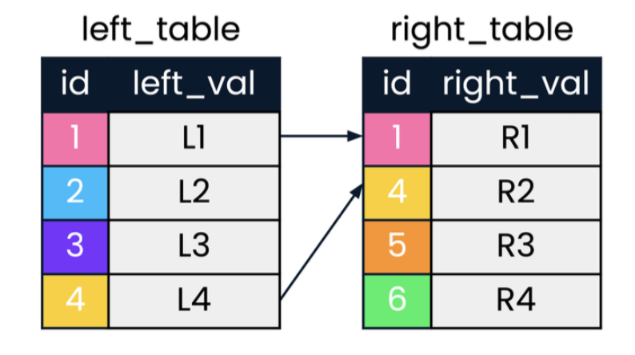

# The difference between INTERSECT and INNER JOIN

## Overview
```INTERSECT``` compares entire rows across two result sets, whereas ```INNER JOIN``` combines columns from two tables based on a condition.

## What INTERSECT does
- ```INTERSECT``` is used to get common rows across the datasets.
- It's not necessary to have any relationship between the tables we want to harvest the data.


### Example
Imagine that we have following two tables.

#### Subject Table (subjects)
| subject_id | subject_name |
| ---- | ---- |
| 1 | English |
| 2 | Science |
| 3 | PE |
| 4 | History |
| 5 | Math |

#### Teacher Table (teachers)
| teacher_id | teacher_name | subject_id |
| ---- | ---- | ---- |
| 1 | Andy | 1 |
| 2 | Bob | 2 |
| 3 | Charlie | 3 |
| 4 | David | 4 |
| 5 | Eric | 5 |

#### Syntax
```
SELECT subject_id
FROM   subjects
INTERSECT
SELECT subject_id
FROM   teachers
ORDER  BY subject_id; 
```

#### Result
Retrieved the common rows across the two datasets, the result of ```SELECT subject_id FROM   subjects``` and the other one of ```SELECT subject_id
FROM  teachers``` (and it's going to be every row in this case).
| subject_id |
| ---- |
| 1 |
| 2 |
| 3 |
| 4 |
| 5 | 

## What INNER JOIN does
- ```INNER JOIN``` is used to combine the rows from two tables based on a related column between them.
- It requires a join condition to be specified, typically matching key columns between tables.


### Example
Imagine that we have following two tables.

#### Subject Table (subjects)
| subject_id | subject_name |
| ---- | ---- |
| 1 | English |
| 2 | Science |
| 3 | PE |
| 4 | History |
| 5 | Math |

#### Teacher Table (teachers)
| teacher_id | teacher_name | subject_id |
| ---- | ---- | ---- |
| 1 | Andy | 1 |
| 2 | Bob | 2 |
| 3 | Charlie | 3 |
| 4 | David | 4 |
| 5 | Eric | 5 |

#### Syntax
```
SELECT teacher_id,
       teacher_name,
       subject_name
FROM   subjects sbj
       INNER JOIN teachers tcr
               ON sbj.subject_id = tcr.subject_id; 
```
#### Result
The two table are joined by the subject_id row. In this case, we can see the subject name that each teacher is in charge of.
| teacher_id | teacher_name | subject_name |
| ---- | ---- | ---- |
| 1 | Andy | English |
| 2 | Bob | Science |
| 3 | Charlie | PE |
| 4 | David | History |
| 5 | Eric | Math |


## Summary
```INTERSECT``` is uset to find common rows in two datasets, while ```INNER JOIN``` is used to connect tables based on a defined relationship.